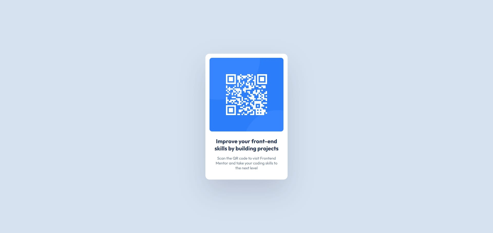

# Frontend Mentor - QR code component solution

This is a solution to the [QR code component challenge on Frontend Mentor](https://www.frontendmentor.io/challenges/qr-code-component-iux_sIO_H). Frontend Mentor challenges help you improve your coding skills by building realistic projects. 

## Table of contents

- [Overview](#overview)
  - [Screenshot](#screenshot)
  - [Links](#links)
- [My process](#my-process)
  - [Built with](#built-with)
  - [What I learned](#what-i-learned)
  - [Continued development](#continued-development)
  - [Useful resources](#useful-resources)
- [Author](#author)
- [Acknowledgments](#acknowledgments)

## Overview

### Screenshot

### Links

- Solution URL: [GitHub Repository](https://github.com/fatihpnrbs/qr-code-component-frontendmenthorch)
- Live Site URL: [Live Site](https://fatihpnrbs.github.io/qr-code-component-frontendmenthorch/)

## My process

### Built with

- Semantic HTML5 markup
- CSS custom properties
- Flexbox
- Mobile-first workflow

### What I learned

I learned how to center elements using Flexbox and how to create a responsive card component.
I also learned the importance of:
- Using semantic tags like `<main>` for accessibility (WCAG).
- Using `max-width` instead of fixed width for responsiveness.
- Correct file paths for images on GitHub Pages.

### Continued development

My primary goal is to become a proficient **Full Stack Developer**. Once I establish a strong technical foundation in web development, I plan to expand my expertise into **Prompt Engineering**.

Additionally, I have a growing interest in **Data Science** and **Machine Learning**, which I intend to explore as complementary skills to my development career in the long term.

### Useful resources

- [MDN Web Docs](https://developer.mozilla.org/en-US/) - This is the absolute best documentation for web development. It helped me understand semantic HTML tags and how to center elements using CSS Flexbox.
- [Google Fonts](https://fonts.google.com) - I used this to import the 'Outfit' font family as required by the design style guide.

## Author

- Frontend Mentor - [@fatihpnrbs](https://www.frontendmentor.io/profile/fatihpnrbs)
- GitHub - [fatihpnrbs](https://github.com/fatihpnrbs)
- LinkedIn - [Fatih Pınarbaşı](https://www.linkedin.com/in/fatihpb/)

## Acknowledgments

Thanks to **Frontend Mentor** for providing this challenge. It was a great practice project to refine my layout skills.
